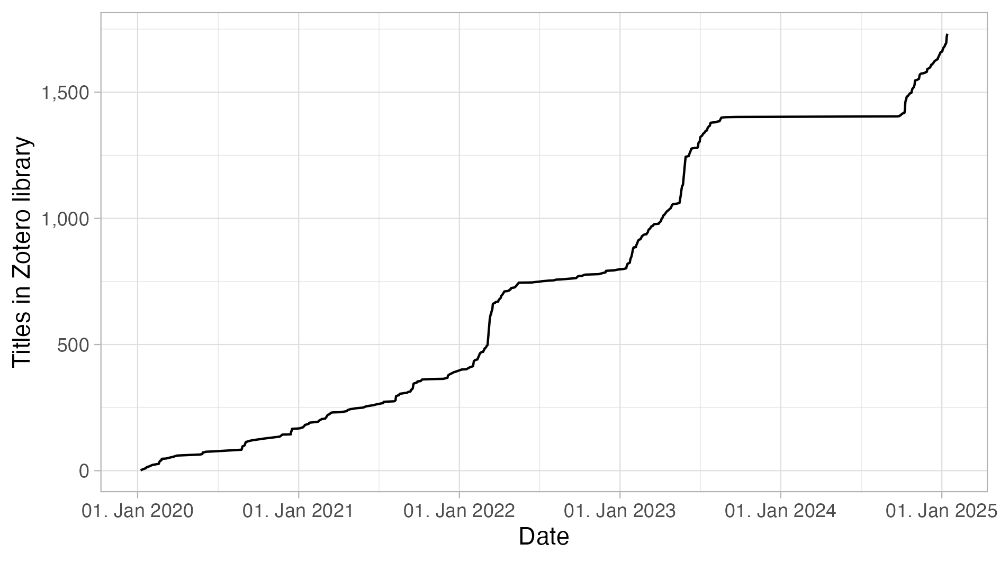

To replicate for your own library, in Zotero navigate to

File > Export Library

Make sure to choose `.csv` as export format and save under `library.csv`

# Example

My plot as of `2025-01-14`.

Can you spot:

- Bachelor thesis
- Master thesis
- A year of working in the private sector

?